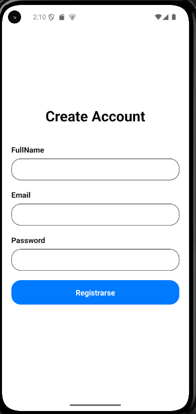
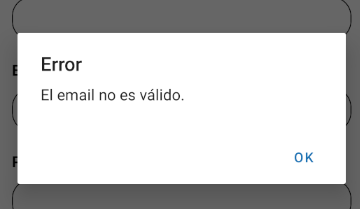
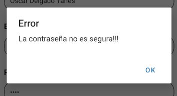

# Ejercicio 1: Pantalla de Registro de Usuario

Este proyecto utiliza **Expo Router** junto con **React Navigation Drawer** para implementar un menú lateral (Drawer).

---

## Objetivo

Crear una pantalla de registro de usuario en **React Native** que cumpla con los siguientes requisitos:

- Inputs para nombre completo, email y contraseña.
- Validación de los datos ingresados.
- Envío de los datos a la API de registro.
- Mostrar mensajes de éxito o error.
- Redirigir a la pantalla de login tras un registro exitoso.

---

Primero, creamos el archivo RegisterScreen.tsx que será nuestra pantalla de registro, contiene 3 inputs de un formulario, y un botón para enviar el formulario. Cuando se envía el formulario, recoge los datos del mismo y los envia a la API del `guapísimo de adrián` con el verbo POST para enviar los datos del nuevo usuario.

Primero, con la librería que he buscado `validator` para validar automáticamente compruebo la validación del email y de la password.

```ts
const handleRegister = () => {
  if (!validator.isEmail(email)) {
    Alert.alert("Error", "El email no es válido.");
    return;
  }
  if (!validator.isStrongPassword(password)) {
    Alert.alert("Error", "La contraseña no es segura!!!");
    return;
  }
};
```






---
Luego, añadimos un botón para llamar a esa función que valida los botones y también le hacemos que sea para enviar los datos. Como va a hacer una llamada a un servidor, para que no hayan problemas en la transferencia entre multitudes, se pone en la función la palabra `async` y en el método que lo llama `await`. Todo se comprueba dentro de try-catch para controlar errores.

```ts
const handleRegister = async () => {
    if (!validator.isEmail(email)) {
      Alert.alert("Error", "El email no es válido.");
      return;
    }
    if (!validator.isStrongPassword(password)) {
      Alert.alert("Error", "La contraseña no es segura!!!");
      return;
    }

    const userData: RegisterData = {
      fullname: fullName,
      email,
      pswd: password,
    };

    try {
      const data = await registerUser(userData);
      if (data.ok) {
        Alert.alert("Succesful", `Account created! Hello ${fullName}!)`);
        setFullName("")
        setEmail("")
        setPassword("")
        router.push("./(drawer)/welcome");
      }
      if (data.status === 400) {
        Alert.alert("Error", "Incorrect data...");
      }
      if (data.status === 409) {
        Alert.alert("Error", "Email already exists...");
      }
    } catch (error) {
      console.log(error);
    }
  };
```

También, para validar la información que se manda, he creado un objeto en `types/api_types/RegisterType.ts` que tiene los elementos que recibe el endpoint del `grandioso del adrián`. 

Para la llamada a la api, me he creado un `service/Api.ts`:

```ts
import { RegisterData } from "../types/api_types/RegisterType";

const API_BASE_URL = "http://IP_DEL_PROFESOR";

export const registerUser = async (userData: RegisterData) => {
  try {
    const response = await fetch(`${API_BASE_URL}/auth/register`, {
      method: "POST",
      headers: { "Content-Type": "application/json" },
      body: JSON.stringify(userData),
    });

    const data = await response.json();

    return { ok: response.ok, status: response.status, data };
  } catch (error) {
    return { ok: false, status: 0, data: { message: "Error de conexión" } };
  }
};
```
- Importa el tipo del objeto que contiene el usuario y le dice a la función lo que recibe es como RegisterData. 
- Una constante de tu url, para luego si en un futuro se cambia de url se cambie una sola vez.
- Método await-async ya que hace una llamada Https. (POST)
- Envia la información convertida en JSON `JSON.stringify(userData)`
- La ejectuta y retorna 2 posibilidades: 
  - ok: los códigos de respuesta del 200-299. (Los de acción permitida)
  - status: el código de respuesta.

 Así desde la pantalla controlo los errores que me devuelve la petición.

`Así de simple, fasilito o que mi bro?`

---

```ts
try {
      const data = await registerUser(userData);
      if (data.ok) {
        Alert.alert("Succesful", `Account created! Hello ${fullName}!)`);
        setFullName("")
        setEmail("")
        setPassword("")
        router.push("./(drawer)/welcome");
      }
      if (data.status === 400) {
        Alert.alert("Error", "Incorrect data...");
      }
      if (data.status === 409) {
        Alert.alert("Error", "Email already exists...");
      }
    } catch (error) {
      console.log(error);
    }
```

Luego, en la pantalla, llamo a la función con async-await en la función, y compruebo el código que devuelve la petición Http. Si sale todo okey, envío un mensaje al usuario de que su cuenta ha sido creada correctamente, borro los datos del formulario, y redirecciono hacia el Welcome (ya que no está creado el login aún).

Si sale error, mostraría otros mensajes...

No se puede probar porque la url del `grandioso adrián` no la tengo así que toca rezarle al diosito y que esto funcione a la primera todo :d. Pero se supone que funcionaría perfecto todo.

[Volver](../README.md)