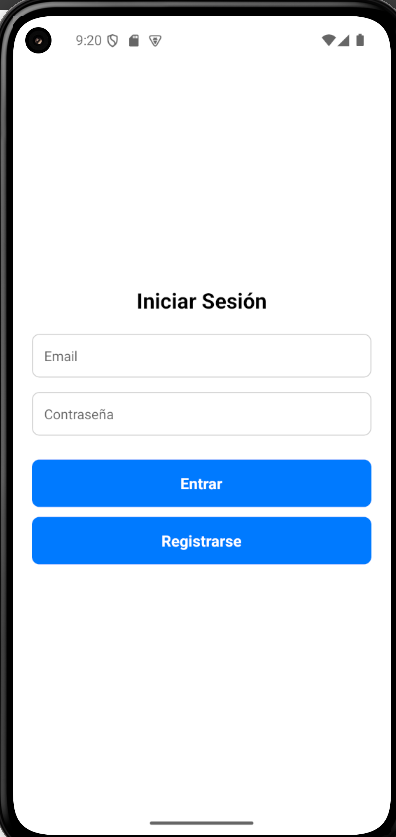
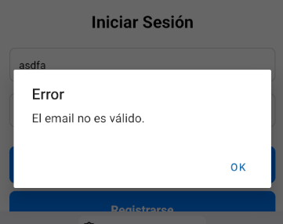
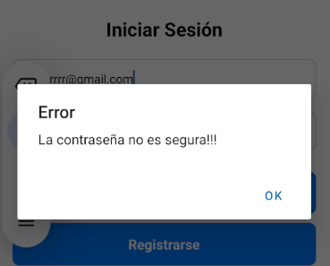
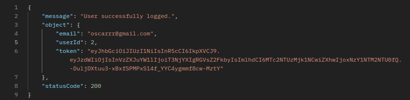
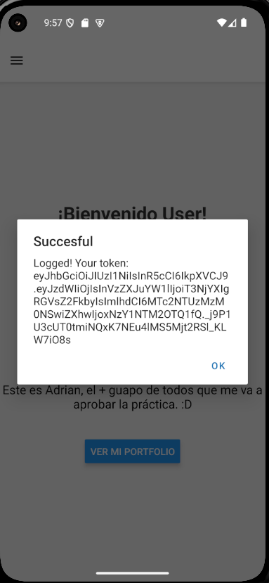
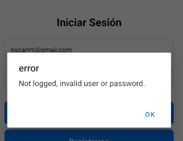
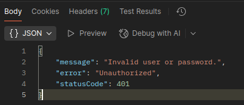

# 📘 README — Crea una pantalla de inicio de sesión

En este apartado vamos a crear una pantalla de login para nuestra app, controlado a través de tokens JWT.

## Diseño

Mi pantalla tiene un aspecto básico para el test de la app.



Al hacer click a "Entrar" llama a un método que válida los inputs `(email y pswd)`. Una vez son validados, llama a la api:

```js
export default function LoginScreen() {
  const [email, setEmail] = useState("");
  const [password, setPassword] = useState("");

  const handleLogin = async () => {
    if (!validator.isEmail(email)) {
      Alert.alert("Error", "El email no es válido.");
      return;
    }
    if (!validator.isStrongPassword(password)) {
      Alert.alert("Error", "La contraseña no es segura!!!");
      return;
    }

    const userData: LoginData = {
      email,
      pswd: password,
    };

    try {
      const data = await loginUser(userData);

      console.log("Respuesta login:", data);

      if (data?.object == null) {
        Alert.alert("error", `Not logged, invalid user or password.`);
        return;
      }

      if (data?.object.token != null) {
        await saveToken(data?.object.token);
        Alert.alert("Succesful", `Logged! Your token: \n${data.object.token}`);
        setEmail("");
        setPassword("");

        router.push("./(drawer)/welcome");
      }

      if (data?.object.status === 400) {
        Alert.alert("Error", "Incorrect data...");
      }
      if (data?.object.status === 401) {
        Alert.alert("Error", "Email or password wrong...");
      }
    } catch (error) {
      console.log(error);
    }
  };
```

Al llamar a la api, recojo la información que me devuelve el endpoint y compruebo que me ha devuelto el token para confirmar si ha sido correcto el login.

Sino, compruebo el código de error y muestro por consola los errores.

---

Para enviar los datos al endpoint de la api, me he creado un tipo en mis `/api_types/RegisterType.ts` para decir que esos son los datos que envío.

```js
const userData: LoginData = {
  email,
  pswd: password,
};
```


---

Luego, controlo la respuesta de la api,

```js
try {
      const data = await loginUser(userData);

      console.log("Respuesta login:", data);

      if (data?.object == null) {
        Alert.alert("error", `Not logged, invalid user or password.`);
        return;
      }

      if (data?.object.token != null) {
        await saveToken(data?.object.token);
        Alert.alert("Succesful", `Logged! Your token: \n${data.object.token}`);
        setEmail("");
        setPassword("");

        router.push("./(drawer)/welcome");
      }

      if (data?.object.status === 400) {
        Alert.alert("Error", "Incorrect data...");
      }
      if (data?.object.status === 401) {
        Alert.alert("Error", "Email or password wrong...");
      }
    } catch (error) {
      console.log(error);
    }
  };
```

Al llamar a la api, puede dar posibles resultados, el primero es que se haya mandado la petición y no se hayan validado correctamente los campos (email y pswd).





---

Al logearnos correctamente, para comprobar lo que nos devuelve, abrimos el Postman y comprobamos las respuestas del endpoint.



Aqui podemos comprobar que un logeo exitoso nos devuelve el token, userId y el código. Al logearnos exitosamente, guardamos el token en nuestro almacenamiento local para la sesión.

```js
if (data?.object.token != null) {
  await saveToken(data?.object.token);
  Alert.alert("Succesful", `Logged! Your token: \n${data.object.token}`);
  setEmail("");
  setPassword("");

  router.push("./(drawer)/welcome");
}
```

Al ser el login exitoso (compruebo que el token exista para ver si fue exitoso), guardamos el token en nuestro almacenamiento y redirigimos al usuario a la pantalla Welcome.



---

Otro posible resultado es que ya al haber introducido correctamente los datos, la petición sale errónea.



Para comprobar este error hay que ver lo que devuelve el endpoint de la api. Para ello vamos a ir al Postman y ver que posibles resultados hay.



Al tener ya previamente creada la cuenta, y nos intentamos logear y es erróneo el login, vemos que no nos devuelve el cuerpo de un login exitoso.

```js
if (data?.object == null) {
  Alert.alert("error", `Not logged, invalid user or password.`);
  return;
}
```

Entonces, para comprobar que el login no ha sido exitoso, comprobamos si la petición devuelve el cuerpo, sino es que no ha sido exitoso.

---

## Uso de AsyncStorage para almacenar el token

Este servicio utiliza @react-native-async-storage/async-storage para guardar el token de sesión de forma persistente en el dispositivo móvil. Esto permite que el usuario permanezca autenticado aunque cierre la app.

Funcionalidades implementadas

- Guardar token

```js
export const saveToken = async (token: string): Promise<void> => {
  try {
    await AsyncStorage.setItem(TOKEN_KEY, token);
  } catch (error) {
    console.log(error);
  }
};

// Para llamarlo

await saveToken(token);
```

Guarda el token recibido tras un login exitoso en el almacenamiento interno.

- Obtener token

```js
export const getToken = async (): Promise<string | null> => {
  try {
    return await AsyncStorage.getItem(TOKEN_KEY);
  } catch (error) {
    console.log(error);
    return null;
  }
};

// Para llamarlo

const token = await getToken();
```

Recupera el token almacenado para usarlo en peticiones autenticadas.

- Eliminar token

```js
export const removeToken = async (): Promise<void> => {
  try {
    await AsyncStorage.removeItem(TOKEN_KEY);
  } catch (error) {
    console.log(error);
  }
};

// Para llamarlo

await removeToken();
```

Borra el token del almacenamiento al cerrar sesión.

[Volver](../README.md)
