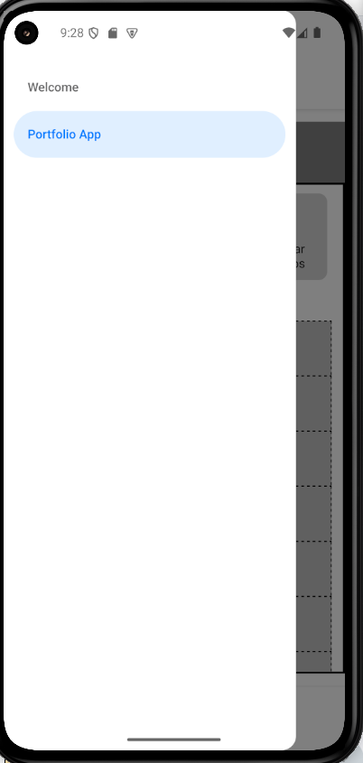

# 📘 README — Modificar el Drawer

Ya implementamos el Drawer en el primer ejercicio de esta práctica.

Para poner por defecto en el Drawer la pantalla de **Welcome.tsx** hay que hacer unos simples pasos.

Esta es actualmente nuestra estructura del **_layout.tsx** del (drawer):

```js
import { Drawer } from "expo-router/drawer";

export default function DrawerLayout() {
  return (
    <Drawer screenOptions={{ headerTitle: "" }}>
      <Drawer.Screen
        name="(tabs)"
        options={{
          title: "Portfolio App",
        }}
      />
      <Drawer.Screen
        name="profile"
        options={{
          title: "Perfil",
        }}
      />
    </Drawer>
  );
}
```

Para poner principal la pantalla welcome.tsx, hay que ponerla arriba del todo del drawer:

```js
import { Drawer } from "expo-router/drawer";

export default function DrawerLayout() {
  return (
    <Drawer screenOptions={{ headerTitle: "" }}>
      <Drawer.Screen
        name="welcome"
        options={{
          title: "Welcome",
        }}
      />
      <Drawer.Screen
        name="(tabs)"
        options={{
          title: "Portfolio App",
        }}
      />
    </Drawer>
  );
}
```

Eliminamos el Drawer.Screen innecesario que creamos de ejemplo "profile" y añadimos el primero de todos el welcome, y seguido del (drawer) para que cargue el drawer.

De momento, nuestro Drawer se vería asi:



[Volver](../README.md)