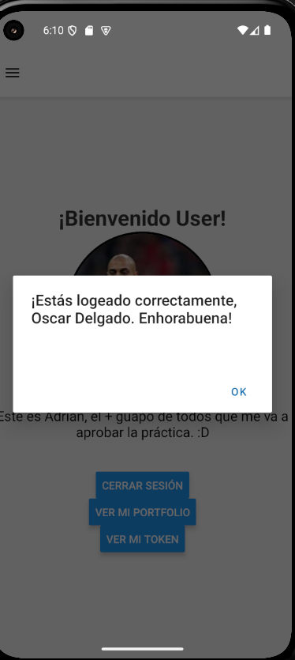

# 📘 Botón en la pantalla de Bienvenida

Para esta actividad, solo he tenido que añadir un componente Button en la pantalla de Welcome. Este botón llama a buttonDisplayToken():

## welcome.tsx

```js
const buttonDisplayToken = async () => {
    try {
      const data = await authApiService.welcomeApi();

      console.log(data);

      if (data.status == 200) {
        Alert.alert(data.object);
      } else {
        console.log("Token expirado o no encontrado.");
      }
    } catch (error) {
      console.log(error);
    }
  };
```
Esta función llama al servicio de la Api y hace una petición al endpoint Get(/welcomes) y muestra con un Alert el mensaje de lo que devuelve el endpoint.

## Api.ts

```js
const welcomeApi = async (): Promise<WelcomeDataGet> => {
  try {
    const token = await authStorageService.getToken();

    const response = await fetch(`${API_BASE_URL}/welcome`, {
      method: "GET",
      headers: { Authorization: `Bearer ${token}` },
    });

    const data = await response.json();

    console.log(data);

    return { status: data.statusCode, object: data.object };
  } catch (error) {
    console.log(error);
    return { status: 404, object: "Encontradon't" };
  }
};
```
Primero me traigo el token de sesión desde el service del AuthStorage. Luego hago la llamada al endpoint y veo lo que me devuelve.

```
 LOG  {"message": "Received sucessfully!", "object": "¡Estás logeado correctamente, Oscar Delgado. Enhorabuena!", "statusCode": 200}
```

A mí unicamente del mensaje de respuesta de la api es el "statusCode" y el "object", que es lo que voy a manipular. Así que me creé un type WelcomeDataGet con status y object, y me retorno únicamente esos dos.

```
export type WelcomeDataGet = {
  status: number;
  object: string;
};
```





[Volver](../README.md)