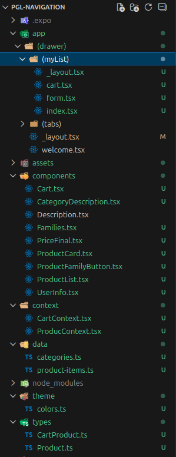

# 📘 README — Reutilización de la lista de recuento de la práctica anterior.

Para reciclar la práctica anterior, he tenido que traer todos los **datos** / **componentes** / **pantallas** / **tipos** / **contextos** / **layout** / **assets** ...

He creado otro grupo dentro del drawer, tal y como he hecho con (tabs), pero esta vez se llama (myList). Ahí estará la pantalla principal de la lista de recuento.

```
app/
 ├─ (drawer)/
    ├─ _layout.tsx
    └─ (tabs)/
    ├  ├─ _layout.tsx  
    ├  ├─ codeQr.tsx     
    ├  └─ user-info.tsx  
    └─ (myList)/
        ├─ _layout.tsx  
        ├─ cart.tsx
        ├─ form.tsx     
        └─ index.tsx  
```

Luego he importado todos los elementos ya mencionados, ya que es un proyecto ya creado, no he tenido que cambiar ninguna funcionalidad, solo he tenido que arreglar problemas de rutas de carpetas y listo.



Listo, ahora tengo otra pestaña en el drawer que es la lista de recuento tal y como se quedó en la practica pasada. (Funciona mal pero funciona, espero que tengas piedad bb)

[Volver](../README.md)